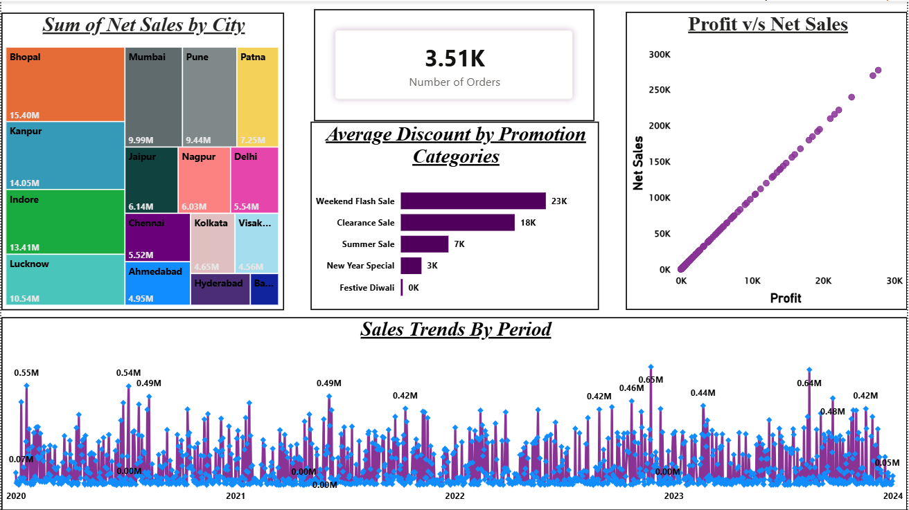
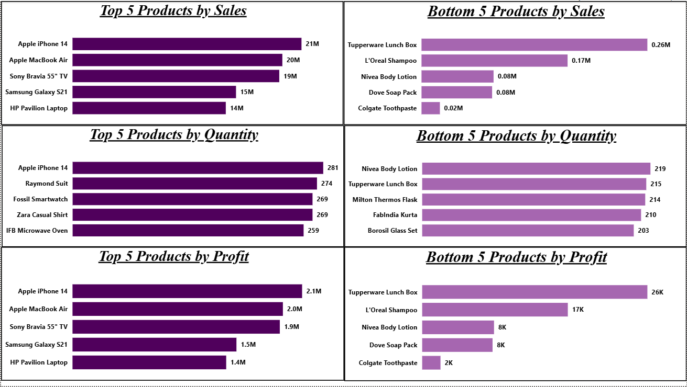
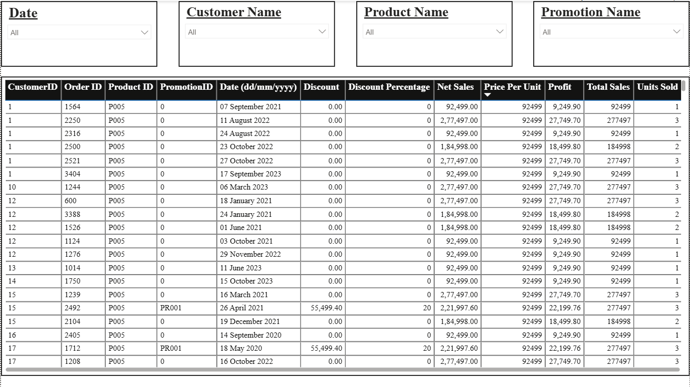
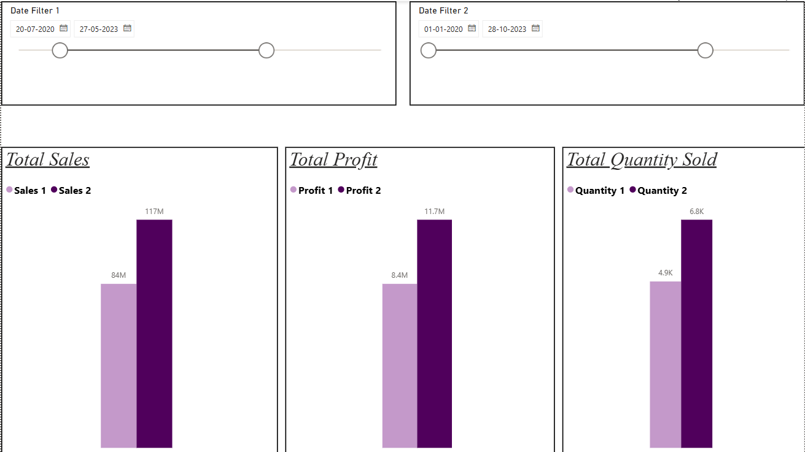
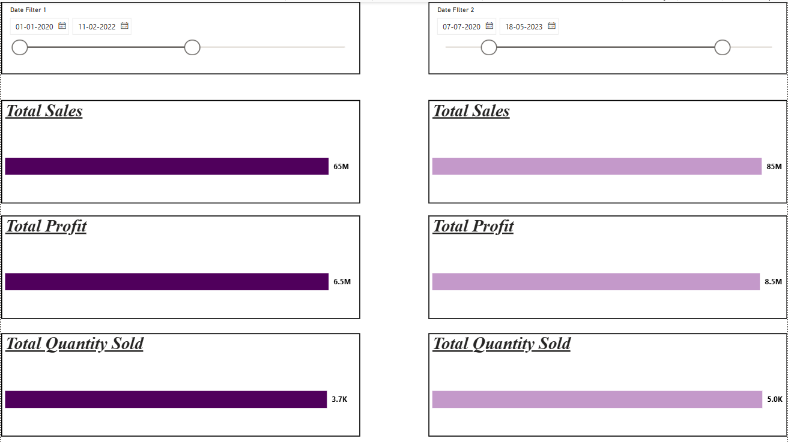

# Sales Performance & Profit Analysis Dashboard

An interactive Power BI dashboard developed to analyze sales performance, profitability, product performance, promotional discounts, and sales trends.

## Dashboard Preview

### 1. Overview

The overview dashboard provides a high-level view of sales performance, including city-wise sales, order count, promotional discounts, profit vs. net sales, and sales trends over time.

### 2. Top & Bottom 5 Analysis

Analyzes the top and bottom 5 products based on:

- Sales
- Profit
- Quantity Sold

### 3. Table Visual

Provides detailed transaction-level information with interactive filters for exploring customer, product, promotion, and date-related data.

### 4. Sales, Profit & Quantity Comparison

Allows users to compare Sales, Profit, and Quantity Sold across two independently selected date ranges using interactive date filters.

### 5. Edit Interactions

Demonstrates interactive visual filtering and cross-highlighting between different charts within the dashboard.

## Key Features

- Interactive sales and profit analysis
- Top and Bottom 5 product analysis
- City-wise sales analysis
- Promotion and discount analysis
- Sales trend analysis
- Dynamic date-range comparison
- Interactive slicers and filters
- Cross-filtering and visual interactions
- Detailed transaction-level data exploration

## Data Preparation

The raw Excel dataset was cleaned and transformed using Power Query before building the data model and dashboard.

The data preparation process included:

- Handling missing and null values
- Data type transformation
- Data cleaning and formatting
- Preparing data for analysis and visualization

## Tools & Technologies

- Microsoft Power BI
- Power Query
- DAX
- Data Modeling
- Microsoft Excel

## Project Objective

The objective of this project was to transform raw sales data into an interactive business intelligence dashboard for analyzing sales trends, profitability, product performance, and comparative business performance.

## Project File

The Power BI `.pbix` file is included in this repository for reference.
